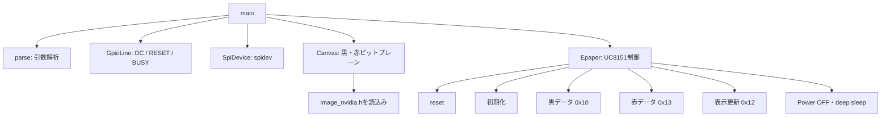
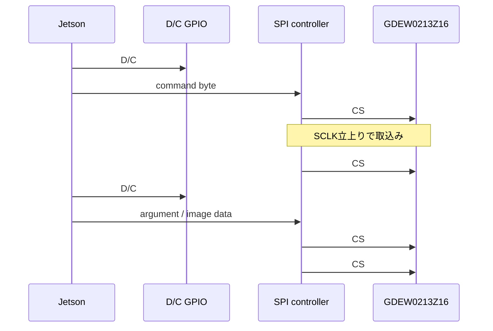
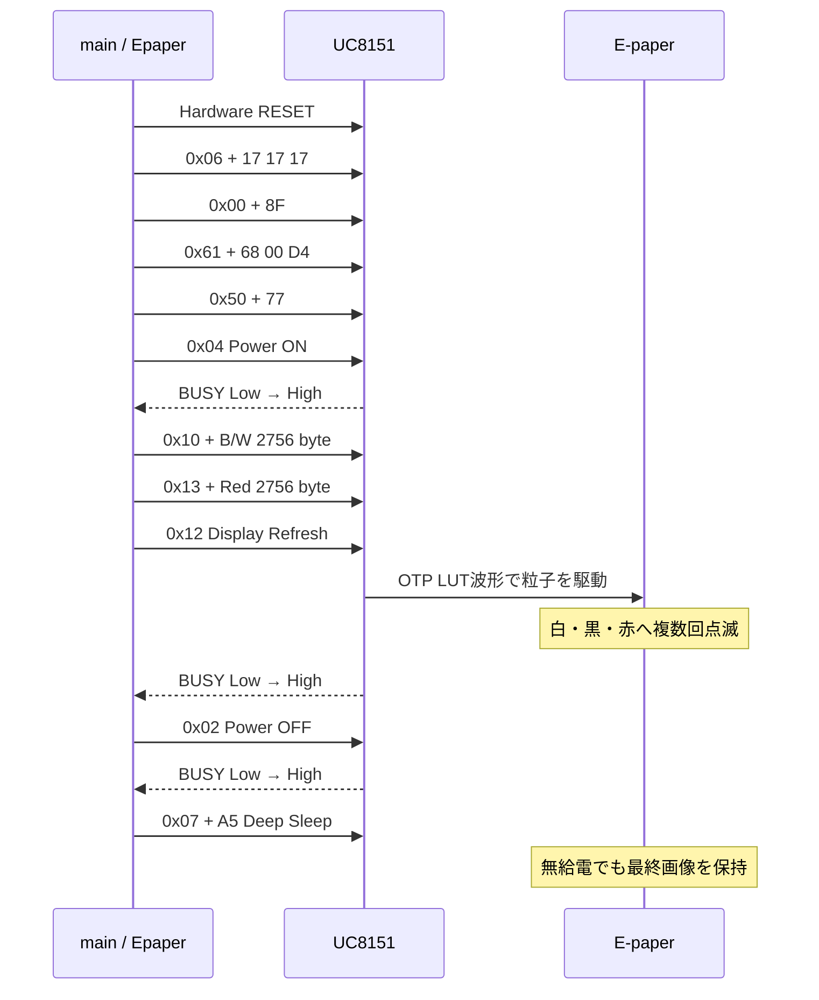
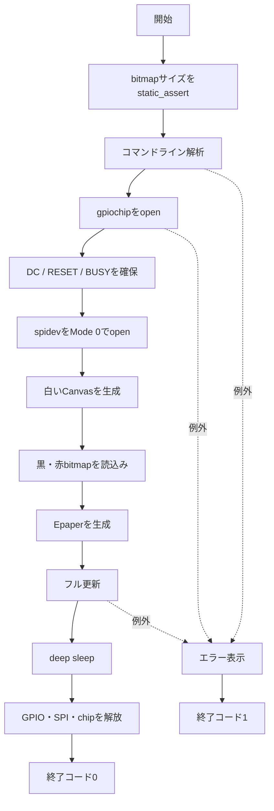

# GDEW0213Z16 使用方法と `main.cpp` 詳細解説

## 1. 概要

この文書は、Jetson Orin NXからLinuxの`spidev`と`libgpiod`を使い、Good Displayの2.13インチ3色電子ペーパー **GDEW0213Z16** を駆動する方法と、本プロジェクトの`main.cpp`の処理を説明する。

- 表示器: GDEW0213Z16（UC8151 / IL0373系）
- 解像度: 104 × 212 pixel（コードでは縦長方向）
- 表示色: 白、黒、赤
- 通信: 4線式SPI（MOSI、SCLK、CS、D/C）
- GPIO制御: `libgpiod`
- SPI制御: Linux `spidev`

> 電子ペーパーは画像RAMへデータを書いた後、表示更新コマンドで電気泳動粒子を動かす。更新中に白・黒・赤へ点滅するのは正常な動作である。

## 2. ハードウェア接続

表示器とJetsonの信号電圧は **3.3 V** とする。5 Vロジックを直接入力してはいけない。

| EPD信号 | Jetson側 | 役割 |
|---|---|---|
| VCC | 3.3 V | ロジックおよび表示器の電源 |
| GND | GND | 共通GND |
| DIN / SDIN | SPI MOSI | JetsonからEPDへ送るデータ |
| CLK / SCLK | SPI SCLK | SPIクロック |
| CS# | 使用するSPIデバイスのCS | Lowの間、EPDを選択 |
| D/C# | 40ピンヘッダ Pin 13 | Low: コマンド、High: データ |
| RES# / RESET | 40ピンヘッダ Pin 16 | Lowアクティブのリセット |
| BUSY | 40ピンヘッダ Pin 18 | Low: 処理中、High: Ready |

動作確認済みのGPIO line offset:

| 用途 | ヘッダPin | gpiochip0 line offset | オプション |
|---|---:|---:|---|
| D/C# | 13 | 122 | `--dc 122` |
| RESET | 16 | 126 | `--rst 126` |
| BUSY | 18 | 125 | `--busy 125` |

ヘッダの物理Pin番号とGPIO line offsetは別の番号である。構成が異なる場合は`gpioinfo`で確認する。

## 3. ビルドと実行

```bash
sudo apt update
sudo apt install -y build-essential cmake libgpiod-dev gpiod
cmake -S . -B build
cmake --build build -j
```

実行例:

```bash
sudo ./build/gdew0213z16 \
  --spi /dev/spidev0.0 \
  --chip gpiochip0 \
  --dc 122 --rst 126 --busy 125
```

標準SPI速度は2 MHz、BUSY極性はactive-lowである。通信が不安定なら`--speed 500000`を追加する。BUSYを反転する外付け回路を使う場合だけ`--busy-active-high`を指定する。

## 4. プログラムの構造



| クラス/構造体 | 役割 |
|---|---|
| `GpioLine` | GPIOラインの確保、入出力、解放 |
| `SpiDevice` | spidevのオープン、設定、送信 |
| `Canvas` | 104 × 212の黒・赤プレーン生成 |
| `Epaper` | コマンド送信と更新シーケンス |
| `Args` | 実行時オプションの保持 |

## 5. フレームバッファ

```cpp
constexpr int WIDTH = 104;
constexpr int HEIGHT = 212;
constexpr int ROW_BYTES = WIDTH / 8;
constexpr int FRAME_BYTES = ROW_BYTES * HEIGHT;
```

1行は`104 / 8 = 13 byte`、1色分は`13 × 212 = 2756 byte`。黒・赤の2プレーンで合計5512 byteを転送する。

### 5.1 3色のbit表現

| 表示色 | Black plane | Red plane |
|---|---:|---:|
| 白 | 1 | 1 |
| 黒 | 0 | 1 |
| 赤 | 1 | 0 |

`Canvas::pixel()`は対象pixelを一度両プレーンとも1へ戻し、選択色のプレーンだけ0へする。これにより同じpixelが黒と赤へ同時指定されない。

pixel `(x, y)` のbyte位置とbit mask:

```text
index = y × 13 + floor(x / 8)
mask  = 0x80 >> (x mod 8)
```

左端pixelからbit 7、bit 6、…、bit 0の順になる。

## 6. 画像ヘッダ

現在は`image_nvidia.h`をincludeし、次の配列を使う。

```cpp
epd_bitmap_image3B  // 黒プレーン、2756 byte
epd_bitmap_image3R  // 赤プレーン、2756 byte
```

Arduino用の`PROGMEM`はJetsonでは不要なので空マクロにしている。`static_assert`は各配列が2756 byteであることをコンパイル時に検査する。

`Canvas::load()`は全画面を白にしてから、配列中の0 bitを黒または赤として重ねる。両方が0なら黒を優先する。

## 7. GPIO処理

`GpioLine`は`gpiod_chip_get_line()`でoffsetを取得し、D/CとRESETを出力、BUSYを入力として要求する。デストラクタで`gpiod_line_release()`を呼ぶRAII設計なので、例外時にもGPIOを解放できる。コピーは禁止され、二重解放を防ぐ。

## 8. SPI処理

`SpiDevice`の設定:

- SPI Mode 0: SCLKアイドルLow、立上りエッジで取込み
- 8 bit/word
- デフォルト2 MHz
- MSB first
- JetsonからEPDへのwriteのみ

送信は`SPI_IOC_MESSAGE(1)`で行い、CS#はspidevドライバが転送中だけLowにする。

## 9. SPI信号タイミング

4線SPIではD/C#でコマンドとデータを区別する。



概念波形:

```text
D/C#   ____ command ____/‾‾‾‾‾‾ data ‾‾‾‾‾
CS#    ‾‾\________________/‾‾\____________/‾‾
SCLK   ____/‾\_/‾\_/‾\_/‾\_/‾\_/‾\_/‾\_/‾\____
SDIN   ----D7--D6--D5--D4--D3--D2--D1--D0-----
             ^   ^   ^   ^   ^   ^   ^   ^
             SCLK立上りエッジで取込み
```

データシートの主な最小値:

| 項目 | 最小値 |
|---|---:|
| CS# setup time | 60 ns |
| CS# hold time | 65 ns |
| SCLK write cycle | 100 ns |
| SCLK High幅 | 35 ns |
| SCLK Low幅 | 35 ns |
| SDIN setup time | 30 ns |
| SDIN hold time | 30 ns |

SCLK周期100 nsは理論上10 MHzに相当する。コードの2 MHzは周期500 nsなので仕様に余裕がある。ただし配線や変換基板の影響があるため、問題時は500 kHzへ下げる。

`command()`はD/C#をLowにしてコマンドを送り、引数があればHighへ切り替えて送る。`data()`はD/C#をHighにし、2756 byteのプレーン全体を一度に送る。

## 10. RESETとBUSY

### 10.1 リセット

```text
RESET  ‾‾‾‾‾‾\__________/‾‾‾‾‾‾‾‾‾
       20 ms     10 ms      20 ms
```

1. RESET Highで20 ms
2. RESET Lowで10 ms
3. RESET Highで20 ms
4. BUSY解除を最大5秒待つ

RESETはLowアクティブ。deep sleepから再度起動するにはハードウェアリセットが必要で、プログラムは毎回実行している。

### 10.2 BUSY

```text
BUSY = Low   EPD内部処理中。コマンドを送らない
BUSY = High  Ready。次の処理へ進める
```

`wait_ready()`は10 ms間隔でGPIOを読む。

| 待機場所 | タイムアウト |
|---|---:|
| Reset後 | 5秒 |
| Power ON後 | 10秒 |
| Display Refresh後 | 30秒 |
| Power OFF後 | 10秒 |

## 11. 表示更新シーケンス



### 11.1 コマンドの意味

| コマンド | データ | 意味 |
|---:|---|---|
| `0x06` | `17 17 17` | Booster soft start |
| `0x00` | `8F` | Panel setting（B/W/R、走査方向、LUT選択等） |
| `0x61` | `68 00 D4` | 解像度104 × 212 |
| `0x50` | `77` | VCOM/data interval、border、データ極性 |
| `0x04` | なし | 内部表示電源ON |
| `0x10` | 2756 byte | 白/黒プレーンをRAMへ転送 |
| `0x13` | 2756 byte | 赤プレーンをRAMへ転送 |
| `0x12` | なし | 実パネルの更新開始 |
| `0x02` | なし | 内部表示電源OFF |
| `0x07` | `A5` | チェックコード付きdeep sleep |

このコードはOTP内蔵LUTを使い、LUT波形テーブルは転送しない。`0x12`後の点滅は、コントローラがLUTに従って正負電圧を複数段階で印加するためである。

> GDEW0213Z16の資料や派生ライブラリには設定値・順序が異なる版がある。本プロジェクトの`0x8F`、`0x77`およびPower ON前の設定順は、実機で最終画面が赤一色になる問題を避けるために採用した。Z19やZ98など別型番へそのまま流用しないこと。

## 12. `main()`の処理



必須引数は`--dc`、`--rst`、`--busy`。

| オプション | デフォルト | 説明 |
|---|---|---|
| `--spi` | `/dev/spidev0.0` | SPIデバイス |
| `--chip` | `gpiochip0` | GPIO chip名 |
| `--dc` | 必須 | D/C line offset |
| `--rst` | 必須 | RESET line offset |
| `--busy` | 必須 | BUSY line offset |
| `--speed` | `2000000` | SPIクロックHz |
| `--busy-active-low` | 標準 | BUSY Lowを処理中とする |
| `--busy-active-high` | 無効 | BUSY極性を反転 |

最上位の`try/catch`は例外を表示して終了コード1を返す。GPIOとSPIはデストラクタで解放される。`gpiod_chip`はC APIの生ポインタなので、内側の`catch (...)`でも明示的にcloseする。

## 13. 実行時に見える動作

1. 起動直後は以前の画像または白画面が見える。
2. `0x12`後、白・黒・赤へ複数回点滅する。
3. 25℃では約12〜15秒（データシート値）で最終画像になる。
4. Power OFF後にdeep sleepへ入る。
5. 双安定性により、無給電でも最終画像が残る。

点滅は故障ではない。更新後も全面が赤や黒なら、黒・赤プレーンの極性、`0x00`と`0x50`、型番、BUSY極性、電源、SPI配線を確認する。

## 14. トラブルシューティング

### `BUSY timeout`

- BUSYのline offsetを確認する。
- ヘッダPin番号をline offsetとして指定していないか確認する。
- GNDが共通か確認する。
- 通常は`--busy-active-high`を付けない。
- RESETがHigh → Low → Highへ変化するか測定する。

### 画面が更新されない

- `/dev/spidev0.0`の存在を確認する。
- CSが該当spidevのCSへ接続されているか確認する。
- `--speed 500000`へ下げる。
- D/Cがコマンド時Low、データ時Highかロジックアナライザで確認する。

### 黒と赤が逆、背景が着色する

- 白pixelが両プレーンとも1か確認する。
- 画像変換ツールがactive-high形式ならbit反転する。
- 黒を`0x10`、赤を`0x13`の後へ送っているか確認する。

### ghostingや表示ムラ

- 3色パネルではフル更新を使う。
- 仕様範囲の0〜40℃で使用する。
- 温度変化直後は安定するまで待つ。
- 短時間に連続更新しない。

## 15. コード上の注意と改善候補

- `Canvas`の線、矩形、円、5×7文字描画は残っているが、現在の`main()`は画像読込みだけを使う。
- `static_assert`の文言は`image2.h`だが、実際のincludeは`image_nvidia.h`。機能上問題はないが名称を一般化できる。
- `ROW_BYTES = WIDTH / 8`は幅が8の倍数という前提。一般化するなら`(WIDTH + 7) / 8`とする。
- `gpiod_chip`もRAII化すると明示的な内側の`try/catch`を減らせる。
- BUSY待ちは10 ms polling。GPIO edge eventを使えばイベント駆動にもできる。

## 16. 参考資料

- [GDEW0213Z16 Product Specification Rev. 3.1 (PDF)](https://files.seeedstudio.com/wiki/Grove-Triple_Color_E-Ink_Display_2.13/res/E-paper_2.13_inch.pdf)
- [GxEPD2: GDEW0213Z16対応ドライバ](https://github.com/ZinggJM/GxEPD2)

主要仕様:

- ロジック電源: 2.3〜3.6 V（標準3.3 V）
- 動作温度: 0〜40℃
- 25℃の更新時間: 約12〜15秒
- deep sleep電流: 標準2 µA、最大5 µA
- 4線SPI書込みクロック周期: 最小100 ns

